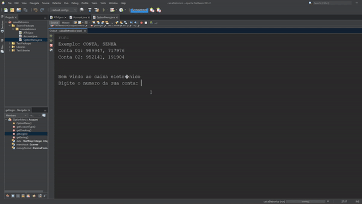

# Caixa Eletrônico

Este é um projeto de um sistema de Caixa Eletrônico (ATM) que simula operações bancárias básicas, como saques, depósitos e consultas de saldo. O objetivo é criar uma interface de usuário simples e funcional, permitindo que os usuários interajam com o caixa eletrônico de forma intuitiva.

<p align="center">
  
</p>
  
## Funcionalidades **(Conta corrente e Poupança)**

- **Saque:** Permite ao usuário realizar saques de sua conta bancária.
- **Depósito:** Permite ao usuário realizar depósitos em sua conta bancária.
- **Consulta de Saldo:** Exibe o saldo atual da conta do usuário.

## Tecnologias Utilizadas

- **Linguagem:** Java
- **IDE:** Apache Netbeans IDE 22

## Como Executar

1. Clone este repositório:
    ```bash
    git clone https://github.com/VolpeBA/CaixaEletronico.git
    ```
2. Importe para o Netbeans ou Eclipse.
3. Execute o codigo.

## Contribuição

Contribuições são bem-vindas! Sinta-se à vontade para abrir issues e enviar pull requests.

## Licença

Este projeto está licenciado sob a GNU General Public License v3.0 (GPL-3.0).
